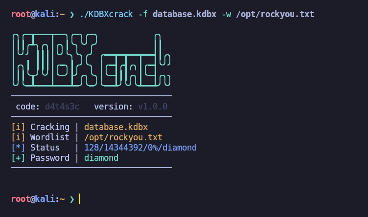

### KDBXcrack

  </br>
 

### Overview

This tool is ideal if you are unable to crack a master password from a [KeePass](https://keepass.info/) database due to incompatibility with version 4.x with [keepass2john](https://github.com/openwall/john/blob/bleeding-jumbo/src/keepass2john.c) and it displays the following error:

>! database.kdbx : File version '40000' is currently not supported!



### Download

```sh
wget --no-check-certificate -q "https://raw.githubusercontent.com/d4t4s3c/KDBXcrack/refs/heads/main/KDBXcrack" && chmod +x KDBXcrack
```

### Usage

```cmd
KDBXcrack -f <FILE> -w <WORDLIST>
```

### Dependencies

- keepassxc-cli
